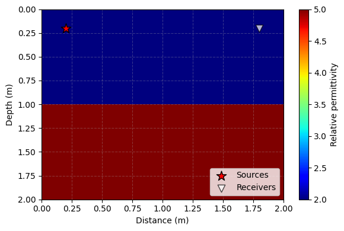
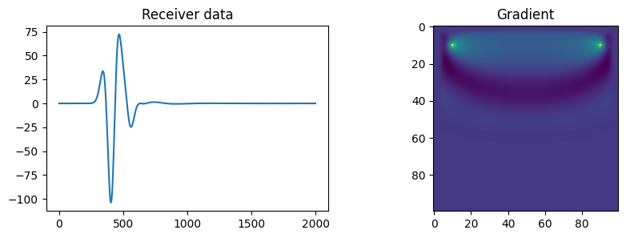

# DeepGPR

DeepGPR provides a wave propagation module for PyTorch, designed for applications such as Ground Penetrating Radar (GPR) imaging and inversion. Its core concepts are derived from Deepwave. You can use it to perform both forward modeling and backpropagation—thereby enabling the simulation of wave propagation to generate synthetic data—as well as for Full Waveform Inversion (FWI). Furthermore, you can integrate this wave propagation functionality into a larger operational pipeline—incorporating various wavelets, loss functions, and other components—to achieve end-to-end forward and reverse propagation, powered by automatic differentiation and our high-performance operators.


## Features

Supports 2D and 3D forward modeling of Maxwell's equations—via the Finite-Difference Time-Domain (FDTD) method—for both single and multiple excitation scenarios.

Gradients of the output receiver data can be computed with respect to model parameters (relative permittivity, conductivity), the initial wavefield, and source amplitudes.

Utilizes CPML, allowing the width of the PML layer to be configured independently for each boundary.

All operations are executed on the GPU.

Supports techniques such as checkpointing, DDP, and the utilization of CPU memory to minimize GPU memory consumption, thereby enabling the execution of large-scale models.


## Start

Before use, you must ensure that you have an NVIDIA graphics card and have installed a CUDA-enabled version of PyTorch.

DeepGPR can then be installed using

```bash
  pip install DeepGPR
```

A Small Forward Modeling Test

```python
import torch
import DeepGPR
import matplotlib.pyplot as plt

# Set up the parameters and models
device=torch.device("cuda")
dx=0.02
dt=3e-11
nt=2000
er = torch.ones(100, 100,1) * 2  
er[50:,:]=5
se = torch.zeros_like(er)  
er.requires_grad_()
source_location=torch.tensor([[[10,10,0]]],device=device,dtype=torch.int)
receiver_location=torch.tensor([[[10,90,0]]],device=device,dtype=torch.int)
freq=2e8
peak_time = 1 / freq
source_amplitudes = torch.zeros((1,nt,1),device=device)
source_amplitudes[0,:,0]=DeepGPR.ricker(freq, nt, dt, peak_time).to(device)

DeepGPR.plot_survey_geometry(er,source_location, receiver_location,dx)

#forward modeling
r = DeepGPR.compute(
    device=device, dx=dx, dt=dt, 
    source_amplitudes=source_amplitudes,
    source_location=source_location, 
    receiver_location=receiver_location, 
    er=er, se=se
)

(r[-1]**2).sum().backward()

_, ax = plt.subplots(1, 2, figsize=(10, 3))
ax[0].plot(r[-1].detach().flatten().cpu().numpy())
ax[0].set_title("Receiver data")
ax[1].imshow(er.grad.detach())
ax[1].set_title("Gradient")
plt.show()
```




There are more examples in the ./examples.